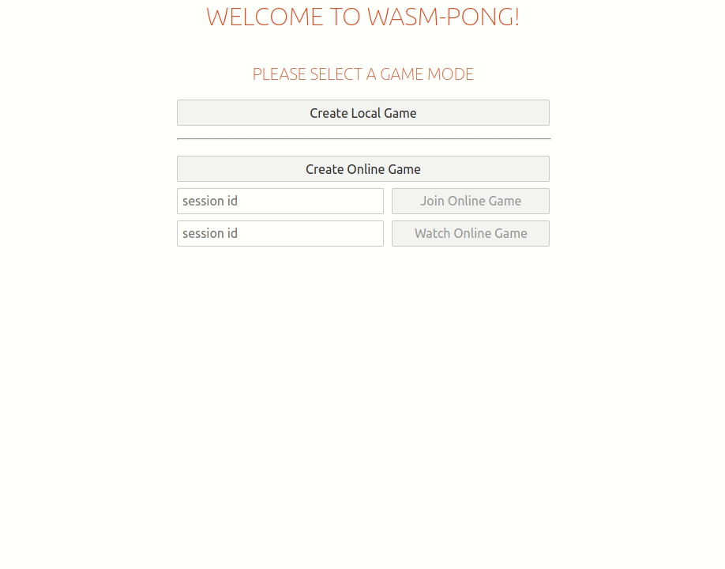

# wasm-pong

Implementation of Pong with local and online multiplayer.
The game is modelled as a series of events, so that other players/observers can easily join a game by consuming the events.

# How to run

- Full setup: `./run-server.sh`
- Dev: `./run-server.dev.sh`
  - For dev the rust server and Svelte client can be started manually to allow debugging

# Implementation

### Overview:
- Game engine is implemented in wasm/rust
- Web GUI is implemented in Svelte
- Web server is implemented in rust/tokio/hyper
- Game events are persisted in kafka

### Details:
- There are 3 roles in a given network game session:
  - Roles: 
    - HOST: Starts the game and invites PEER to join the session
    - PEER: Joins the game session and therefore sets the game session to running
    - OBSERVER: Receives an invitation to watch the game session
  - The game engine is only updated at the HOST, all other roles receive the state of the HOST as the source of truth
  - The PEER sends their inputs to the server from where there are transported to the HOST
- All game events are persisted in Kafka
  - The partition key is the unique session id
  - When a session is created, a new partition is created
    - Warning: For a PoC this is good enough, however in a production system this is not a good idea, if e.g. multiple keys are written to the same partition. It's not a common Kafka pattern to create partitions on-the-go.
    - A different approach would be too just throw away the events of other game sessions
- The server makes use of async rust to allow high concurrency and throughput
  - The game is limited to 60fps in online multiplayer, however this still requires a tick to be send to the peer every ~16ms.

# Demo

